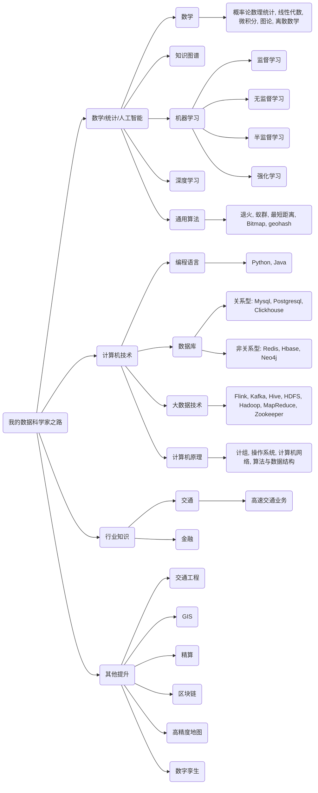

```mermaid
	graph LR

	0(我的数据科学家之路)

	0-->A(数学/统计/人工智能)

	A-->A1(数学)
	A-->A2(知识图谱)
	A-->A3(机器学习)
	A-->A4(深度学习)
	A-->A5(通用算法)

	A1-->A11(概率论数理统计, 线性代数, 微积分, 图论, 离散数学)

	A3-->A31(监督学习)
	A3-->A32(无监督学习)
	A3-->A33(半监督学习)
	A3-->A34(强化学习)

	A5-->A51(退火, 蚁群, 最短距离, Bitmap, geohash)


	0-->B(计算机技术)

	B-->B1(编程语言)
	B-->B2(数据库)
	B-->B3(大数据技术)
	B-->B4(计算机原理)

	B1-->B11(Python, Java)
	
	B2-->B21(关系型: Mysql, Postgresql, Clickhouse)
	B2-->B22(非关系型: Redis, Hbase, Neo4j)
	
	B3-->B31(Flink, Kafka, Hive, HDFS, Hadoop, MapReduce, Zookeeper)
	
	B4-->B41(计组, 操作系统, 计算机网络, 算法与数据结构)

	

	0-->C(行业知识)

	C-->C1(交通)
	C-->C2(金融)

	C1-->C11(高速交通业务)

	

	0-->D(其他提升)
	
	D-->D11(交通工程)
	D-->D12(GIS)
	D-->D13(精算)
	D-->D14(区块链)
	D-->D15(高精度地图)
	D-->D16(数字孪生)
```