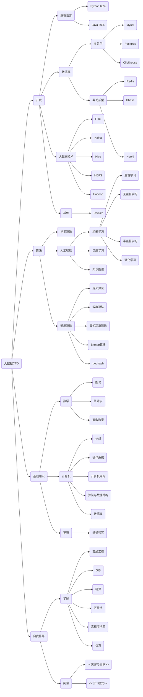

```mermaid
	graph LR

	
	0(大数据CTO)
	0-->A(开发)
	0-->B(算法)
	0-->C(基础知识)
	0-->D(自我修养)
	
	
	A-->A1(编程语言)
	A-->A2(数据库)
	A-->A3(大数据技术)
	A-->A4(其他)
	
	A1-->A11(Python 60%)
	A1-->A12(Java 30%)
	
	A2-->A21(关系型)
	A2-->A22(非关系型)
	
	A21-->A211(Mysql)
	A21-->A212(Postgres)
	A21-->A213(Clickhouse)

	A22-->A221(Redis)
	A22-->A222(Hbase)
	A22-->A223(Neo4j)
	
	A3-->A31(Flink)
	A3-->A32(Kafka)
	A3-->A33(Hive)
	A3-->A34(HDFS)
	A3-->A35(Hadoop)
	
	A4-->A41(Docker)
	
	B-->B1(挖掘算法)
	B-->B2(人工智能)
	B-->B3(通用算法)
	
	B2-->B21(机器学习)
	B2-->B22(深度学习)
	B2-->B23(知识图谱)
	
	B21-->B211(监督学习)
	B21-->B212(无监督学习)
	B21-->B213(半监督学习)
	B21-->B214(强化学习)
	
	B3-->B31(退火算法)
	B3-->B32(蚁群算法)
	B3-->B33(最短距离算法)
	B3-->B34(Bitmap算法)
	B3-->B35(geohash)
	
	C-->C1(数学)
	C-->C2(计算机)
	C-->C3(英语)

	
	C1-->C11(图论)
	C1-->C12(统计学)
	C1-->C13(离散数学)
	
	C2-->C21(计组)
	C2-->C22(操作系统)
	C2-->C23(计算机网络)
	C2-->C24(算法与数据结构)
	C2-->C25(数据库)

	C3-->C31(听说读写)

	D-->D1(了解)
	D-->D2(阅读)
		
	D1-->D11(交通工程)
	D1-->D12(GIS)
	D1-->D13(精算)
	D1-->D14(区块链)
	D1-->D15(高精度地图)
	D1-->D16(仿真)
	
	D2-->D21(<<黑客与画家>>)
	D2-->D22(<<设计模式>>)
	
```