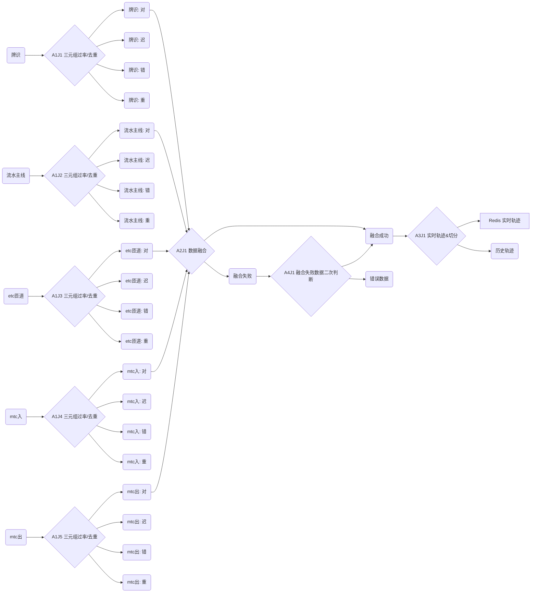

```mermaid
	graph LR

in1(牌识)
in2(流水主线)
in3(etc匝道)
in4(mtc入)
in5(mtc出)

A1J1{A1J1 三元组过率/去重}
A1J2{A1J2 三元组过率/去重}
A1J3{A1J3 三元组过率/去重}
A1J4{A1J4 三元组过率/去重}
A1J5{A1J5 三元组过率/去重}

A1J1D1(牌识: 对)
A1J1D2(牌识: 迟)
A1J1D3(牌识: 错)
A1J1D4(牌识: 重)

A1J2D1(流水主线: 对)
A1J2D2(流水主线: 迟)
A1J2D3(流水主线: 错)
A1J2D4(流水主线: 重)

A1J3D1(etc匝道: 对)
A1J3D2(etc匝道: 迟)
A1J3D3(etc匝道: 错)
A1J3D4(etc匝道: 重)

A1J4D1(mtc入: 对)
A1J4D2(mtc入: 迟)
A1J4D3(mtc入: 错)
A1J4D4(mtc入: 重)

A1J5D1(mtc出: 对)
A1J5D2(mtc出: 迟)
A1J5D3(mtc出: 错)
A1J5D4(mtc出: 重)

A2J1{A2J1 数据融合}

A2J1D1(融合成功)
A2J1D2(融合失败)

A3J1{A3J1 实时轨迹&切分}

A3J1D1[Redis 实时轨迹]
A3J1D2(历史轨迹)

A4J1{A4J1 融合失败数据二次判断}

A4J1D2(错误数据)

in1-->A1J1
in2-->A1J2
in3-->A1J3
in4-->A1J4
in5-->A1J5

A1J1-->A1J1D1
A1J1-->A1J1D2
A1J1-->A1J1D3
A1J1-->A1J1D4

A1J2-->A1J2D1
A1J2-->A1J2D2
A1J2-->A1J2D3
A1J2-->A1J2D4

A1J3-->A1J3D1
A1J3-->A1J3D2
A1J3-->A1J3D3
A1J3-->A1J3D4

A1J4-->A1J4D1
A1J4-->A1J4D2
A1J4-->A1J4D3
A1J4-->A1J4D4

A1J5-->A1J5D1
A1J5-->A1J5D2
A1J5-->A1J5D3
A1J5-->A1J5D4

A1J1D1-->A2J1
A1J2D1-->A2J1
A1J3D1-->A2J1
A1J4D1-->A2J1
A1J5D1-->A2J1


A2J1-->A2J1D1
A2J1-->A2J1D2

A2J1D1-->A3J1

A3J1-->A3J1D1
A3J1-->A3J1D2

A2J1D2-->A4J1

A4J1-->A2J1D1
A4J1-->A4J1D2

```