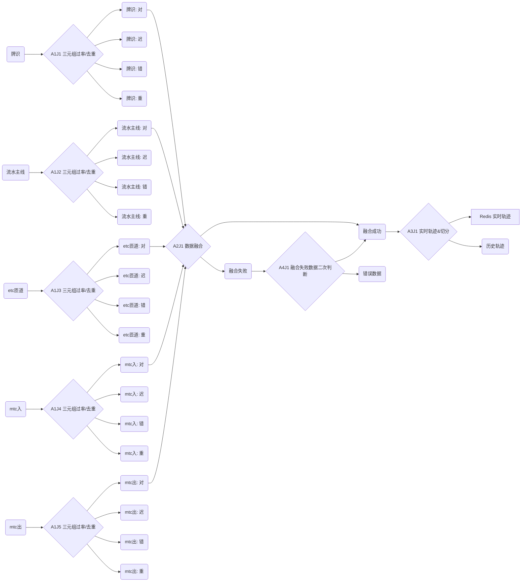

# 技术领域

本发明属于公路运营管理信息化领域，涉及一种对多来源公路交通观测数据进行实时融合的方法和系统。

# 背景技术

高速公路路侧设备(Road Side Unit, RSU)的广泛建设大幅增强了高速公路运营管理的外场感知能力。作为末端感知的基础设施，其产生的海量交通数据在收费、稽核、重点车辆管控、交通流管理优化、车辆行为分析、交通数字孪生等领域起到了至关重要的作用。然而，在当前实际工程中，对RSU数据的应用存在以下几个问题：

- RSU设备类型丰富，数据来源多样化，且存在数据不一致性

  当前高速公路RSU设备主要包括图片车牌设别，射频通信等类型，其产生的数据量及数据内容均有差异，业务场景难以避免数据源选取的问题。

- 各来源数据均存在缺陷

  图片车牌设别通过图片识别技术获取车辆信息，其易受极端天气影响，此外，车牌脏污或损坏、大车遮挡、套牌车等情形都会使得该种技术获取车辆信息失败或有误。

  射频通信技术通过与车内etc卡片进行通信获取卡片信息，进而获得车辆信息，其辐射范围较广，易错误捕获对向车道的车辆信息，且车内etc卡片与车辆信息不对应时则会产生错误数据。此外，天线故障，外部干扰等因素亦会造成车辆信息的丢失。

- 数据质量共性问题

  共性问题主要包括数据重复，数据延迟等。

对于以上问题，在业务场景中往往选取更适合当前业务的单一数据源，并进行适当的数据清洗。如在收费业务中，因其主要根据车内卡片的通信时常及距离进行费用计算，因此一般选取射频通行技术产生的数据作为业务输入；而在稽核业务中，往往是对逃费车辆进行核查，因此会选择图片车牌识别产生的数据，进而计算车辆的真实通行轨迹。但是，单一数据源的数据对上层业务的精准性和服务质量均会产生影响，且会造成信息的浪费，如图片车牌设别包含车道信息，射频通信技术包含车型信息，选其一则会丢失重要的信息量。基于此背景，本发明提出一种对多来源公路交通观测数据进行实时融合的方法。

# 发明内容

本发明旨在克服现有数据捕获技术的不足，充分利用并融合多来源数据信息，输出一套更精准，信息量更丰富的公路交通数据，以及基于该方法实现多来源海量交通数据实时融合系统。

本发明方案的核心思路在于，采用流式的方法实时比对多种不同来源的数据，保留其共有观测记录进行融合，形成车辆通行轨迹，并基于通行轨迹，对各数据源独有的观测记录及延迟数据做时空合理性判断，从而去伪存真，提升数据准确性。

为实现上述技术目的，本发明采用如下技术方案：

## 0. 方案简介

本方案采用流式的方式进行多来源数据的实时融合，主要包含5大步骤：1）单源数据预处理，2）多源数据融合，3 ）车辆通行轨迹计算，4）融合失败数据时空合理性判断，5）迟到数据处理。下文中所称有序三元组指车辆通行数据中的（身份，位置，时间）信息，其中身份即车牌号，采用$v$代替，位置及空间定位，采用$s$代替，时间采用$t$代替，即有序三元组$(v, s, t)$，其作用是定位车辆行驶过程中的时空位置。其中，在本发明中，身份指车牌号，位置采用RSU设备所依附的门架编号，时间即RSU设备捕获到该条通行记录的时间。下文中所称有序四元祖，指在有序三元组$(v,s,t)$的基础上，增加记录的身份码$h$，即有序四元祖$(v,s,t,h)$。

此外，假设有$M$个数据源，分别为$\{S_i,i\in[1,M] \}$。

## 1. 单源数据预处理

本步骤的目的为，对单一数据源进行清洗，标记无效、重复数据，分流出迟到数据，减少对融合精度的影响。

1）无效数据判别

对进入流式计算系统的每一条数据，提取有序三元组$(v,s,t)$，分别从身份，位置，时间三个维度进行判别是否有效。检查内容有：车牌、门架编号、时间是否可解析，车牌是否符合车牌编码规范，门架编号是否真实存在，时间是否为早到/迟到数据。

其中，对于时间有效性判别，假设当前时间为$t_1$，记录时间为$t_0$，则有效时间表现为
$$
\delta_1 \leq t_1 - t_0 \leq \delta_2,
$$
其中，$\delta_1\in(-\infty,0])$为允许接受的早到时间阈值，$\delta_2\in[0,\infty]$为允许接受的迟到时间阈值。

2）Error Code标记

一条无效数据可能涉及一个或多个无效的维度，且一个维度有多种错误类型，为方便管理及后续使用，本发明采用二进制对数据有效性进行编码。朴素思想为，初始化如下二进制编码：

$$
EC_2 = \underbrace{0.....0}_{n个},
$$
再根据错误类型对应位置关系，将$EC_2$中对应位置的的$0$修改为1，并将$EC_2$转为十进制$EC_{10}$，即得到错误类型编码，结合数据源类型，例如数据源A，即可得到该条数据的Error Code为$A\_EC_{10}$。

下面给出错误类型编码过程的数学描述。假设存在$n$种错误类型，先对此$n$种错误约定好位置映射，即定义$f: E\rightarrow L$，其中$f$为集合$E$到集合$L$的映射，$E$为错误类型集合，$L=\{1,\cdots,n\}$为错误类型位置集合，此处要求$f$为双射，即集合$E$与集合$L$中元素一一对应。再对于任意一条数据，对其有效三元组有效性判别后得到其错误类型集合为$\widetilde{E}, \widetilde{E} \subseteq E$，则其十进制错误类型编码为
$$
EC_{10} = \sum_{j\in \widetilde{E}} 2^{f(j)}.
$$

3）重复数据判别

对于任意一条数据，需进行重复性判别，进而过滤重复数据减少数据噪音。判别过程如下。

初始化空集$D$。对于每条数据，提取其有序三元组$(v,s,t)$，首先判别集合$D$中是否包含有序三元组$(v,s,t_x)$，其中$t_x$为时间，即判别该车辆在该门架是否已出现过，若存在，则该条记录的重复性为
$$
\mathbb{1}_{\{\lvert t-t_x \rvert \leq \delta_t\} },
$$
其中，$\mathbb{1}$为示性函数，当条件满足时，其值为1，否则为0，$\delta_t$为时间阈值。若$\mathbb{1}$=1，则判定为重复数据，需对其进行标记或体现在Error Code中，若$\mathbb{1}=0$，则为非重复数据，需将该条有序三元组$(v,s,t)$添加至集合$D$中，用于判别后续数据的重复性。

4）添加身份码

对于每条数据，将其拼接为字符串后，计算其哈希值作为身份码$h$，并添加至原数据。

## 2. 多源数据融合

本步骤接收经过第一步预处理的数据源，即其有序三元组数据不存在错误与重复，将多个数据源进行汇集，提取其有序四元组$(v,s,t,h)$进行无差别计算与处理。对于融合成功的数据，其意味着至少有$k$条来自不同数据源的数据满足融合要求，其中$k\geq 2$，对$k$条数据进行拼接，从而实现融合。对于本步骤融合失败的数据，即$k=1$，由步骤4进行二次处理。

由于当前图片车牌识别技术存在一定的概率将车牌识别错误，因此本步骤首先对多来源数据进行精准融合，对于精准融合失败的数据，进行基于车牌相似性的模糊融合。

1）身份码与记录关系构建

初始化空集$R$，对于每条数据，提取其身份码$h$，结合该条记录本身$r$，形成有序对$<h,r>$，并添加至集合$R$。

2）精准融合

初始化空集$F$。对于任意数据源$S\in \{S_i,i\in[1,M]\}$，对来自$S$的每条数据，提取有序四元组$(v,s,t,h)$​。计算集合$F$中，满足融合条件的元素个数
$$
\label{subset}
n:=\sum_{i=1}^{\lvert F\rvert}\mathbb{1}_{\{\lvert t-t_i \rvert \leq \delta_t\}}\cdot \mathbb{1}_{\{v=v_i\}}\cdot \mathbb{1}_{\{s=s_i\}},\tag{1}
$$
其中$t_i$为集合$F$中第$i$个元素的记录时间，$\delta_t$为可融合的时间差阈值，$v_i$为集合$F$中第$i$个元素的车牌号，$s_i$为集合$F$中第$i$个元素的门架编号，即$n$表示集合$F$中满足车牌一致，门架编号一致，且时间差在规定阈值内的元素个数。

若$n=0$，则判定为无法融合，将该条有序四元组$(v,s,t,h)$添加至集合$F$，并等待$\Delta_t$时间，在$\Delta_t$时间间隔内，若无新的车牌、门架编号一致的有序四元组出现，则进行模糊融合。若$n>0$，则判定为可能融合，该条记录的可融合条件为下式
$$
\label{fusion_condition}
\frac{n+1}{M} \geq p \tag{2}
$$
是否成立，其中，$M$为数据源的个数，$p\in(0,1]$为可融合阈值。

若满足条件$(\ref{fusion_condition})$， 该条数据判定为可融合，则将满足等式$(\ref{subset})$右侧求和符号内条件的元素作为子集$\widetilde{F}$，并将$F-\widetilde{F}$作为新的有序四元组集合$F$，即从原集合$F$中剔除本次已融合的四元组。对于可融合数据，具体融合方式为，提取集合$\widetilde{F}$中所有元素的身份码$h$作为集合$H$，集合$R$中找到第一元素$h\in H$的所有有序对作为集合$\widetilde{R}\in R$，找出集合$\widetilde{R}$中每个有序对中的第二元素，进行横向拼接，即为融合后的数据。

若条件$(\ref{fusion_condition})$不成立，则将该条有序四元组添加至集合$F$，等待$\Delta_t$时间，在$\Delta_t$时间间隔内，若仍未融合（未有新数据进入计算系统融合该条数据），则不可融合，由步骤4进行二次处理。

3）模糊融合

首先定义函数$Q(x,y)$用于计算两个字符串的相似度，其定义域为任意字符串$x$和字符串$y$，值域为$[0,1]$。

在集合$F$中，找出所有满足以下条件
$$
\mathbb{1}_{\{\lvert t-t_i \rvert \leq \delta_t\}}\cdot  \mathbb{1}_{\{s=s_i\}} = 1
$$

的有序四元组作为集合$\widehat{F}$ ，其中$t_i$为集合$F$中第$i$个元素的记录时间，$\delta_t$为可融合的时间差阈值，$s_1$为集合$F$中第$i$个元素的门架编号。即集合$\widehat{F}$中保存了满足门架编号一致，且时间差在规定阈值内的有序四元组。提取集合$\widehat{F}$中所有元素的车牌，作为集合$V$。若$V$为空集，则表明不存在可能融合的数据，由步骤4进行二次处理，否则，提取车牌$\widetilde{v}$，使得$Q(\widetilde{v},v)$最小化，记$sim:=min \space Q(\widetilde{v},v)$，其中$\widetilde{v}\in V$。若$sim < Sim$，其中$Sim\in[0,1]$为相似度阈值，则表明不存在相似车牌，反之，则表明$\widetilde{v}$相似度达标且最接近当前车牌，该条记录的可融合条件为
$$
\label{fuzzy_fusion_con}
\frac{\sum_{i=1}^{\lvert F\rvert}\mathbb{1}_{\{\lvert t-t_i \rvert \leq \delta_t\}}\cdot \mathbb{1}_{\{\widetilde{v}=v_i\}}\cdot \mathbb{1}_{\{s=s_i\}} + 1}{M} \geq p \tag{3}.
$$
若条件$(\ref{fuzzy_fusion_con})$不满足，则不可融合，由步骤4进行二次处理，反之，则表示可融合，提取集合$F$中满足条件$\mathbb{1}_{\{\lvert t-t_i \rvert \leq \delta_t\}}\cdot \mathbb{1}_{\{\widetilde{v}=v_i\}}\cdot \mathbb{1}_{\{s=s_i\}}=1$的元素作为集合$\widetilde{F}$，并将$F-\widetilde{F}$作为新的有序四元组集合$F$。

对于可融合的数据，若当前车牌来自于图片车牌识别，则取$\widetilde{v}$作为真实车牌，反之，则取$v$作为真实车牌。后续融合参见精准融合中的具体融合方式，不做重复描述。

关于字符串相似度计算函数$Q(x,y)$，可采取下列方式之一：

1. 莱文斯坦距离算法

   莱文斯坦距离是编辑距离的一种，指将一个字符串修改为另一个字符串所需的最小编辑次数，其定义如下：
   $$
   \operatorname {lev} _{a,b}(i,j)={\begin{cases}\max(i,j)&{\text{ if }}\min(i,j)=0,\\\min {\begin{cases}\operatorname {lev} _{a,b}(i-1,j)+1\\\operatorname {lev} _{a,b}(i,j-1)+1\\\operatorname {lev} _{a,b}(i-1,j-1)+1_{(a_{i}\neq b_{j})}\end{cases}}&{\text{ otherwise.}}\end{cases}}
   $$
   其中，$a,b$为两个入参字符串，$lev_{a,b}(i,j)$表示$a$的前$i$个字符和$b$的前$j$个字符之间的相似度。本出对其做简化，$i=size(a)$，$j=size(b)$，即比较整个字符串。

   根据莱文斯坦距离算法，可计算得出两个字符串的编辑距离，其为一个数值，再将其进行归一化处理，得到相似度计算函数$Q(x,y)如下$方法如下:
   $$
   Q(x,y) = 1 - \frac{lev_{a,b}(size(a),size(b))}{size(a) \vee size(b)},
   $$
   其中， $x \vee y$指取$x$和$y$之间的大者。

## 3. 车辆通行轨迹计算

本步骤接收步骤2中融合成功或步骤4（见下文）判断为正确的数据，目的在于形成车辆通行轨迹，为步骤4时空合理性判断及步骤5迟到数据处理做准备，且副产物车辆的通行轨迹可直接输出，用于后续的轨迹分析等业务场景。

本步骤计算包含轨迹行成与轨迹切分两部分。

1）轨迹行成

初始化集合T用于保存车牌及其观测序列，具体结构为$T = \{<v_i,\widetilde{T_i}>,i\geq1\}$ ，其中$\widetilde{T_i} = <<s_{ij},t_{ij}>, j \geq1>$为有序$n$元组，保存观测车辆的时空序列。对于任意一条进入本步骤的数据，提取其车牌$v$，门架编号$s$，记录时间$t$。判断集合$T$中是否包含车牌为$v$的元素，若不存在，则建立有序对$<v,<s,t>>$添加至集合$T$，若存在，则在其对应$\widetilde{T_i}$中添加有序对$<s,t>$。

2）轨迹切分

在业务场景中，轨迹切分指将连续的车辆通行观测记录切分为以进入目标路网为起点的，离开目标路网为终点的若干条通行轨迹，从门架视角看，若出现路网入口或出口门架，即需启动切分程序。在业务实践中，由于门架下RSU设备会出现车辆身份捕获错误或遗漏的情况，导致车辆已离开目标路网却未体现在数据中，此时需增加最大通行时间阈值作为切分条件，即若车辆最后一条记录时间至当前时间的时间间隔$\delta_T$已超过设定阈值$\Delta_T$，则启动切分程序。注意，轨迹切分在轨迹行成之后，即任意类型门架进入步骤3，都将进入集合$T$，再由轨迹切分程序对集合$T$进行操作，具体切分过程如下。

1. 出现路网出口门架

   取出集合$T$中车牌为$v$的元素，直接通过消息队列等渠道交由后续轨迹使用业务即可。

2. 出现路网入口门架

   取出集合$T$中车牌为$v$的元素，再取该有序二元组的第二元素$\widetilde{T}$，记$l:=\lvert \widetilde{T}\rvert$为元素个数，若$l\geq2$，则表明存在前续轨迹无出口，则将$\widetilde{T}$中第$1$至$l-1$个元素作为前续轨迹，保留第$l$个元素，即当前入口数据，并重新添加至集合$T$，作为后续轨迹的入口。

3. 出现$\delta_T$已超过设定阈值$\Delta_T$

   处理方式同$1$。

## 4. 融合失败数据时空合理性判断

本步骤接收步骤2中融合失败的数据，目的在于从中提纯出更多正确的数据，以减少数据损失，此部分正确数据融合失败的原因可能为其他来源中发生了车牌识别错误或遗漏等情形，导致融合失败。本步骤主要思想是利用门架间的拓扑结构及距离，判断当前融合失败数据是否与融合成功数据具有拓扑关系及时间关系上的合理性。由于入口门架没有上游门架，用图论的语言表述，即入口门架入度为$0$，其处理方式与内部节点或出口节点有所差异，因此本步骤根据门架类型不同对融合失败数据进行分治处理。

如前文所属，本步骤前置条件为门架间的拓扑结构及距离，在公路交通场景中不允许出现车辆逆行的情况，因此本发明中要求门架拓扑结构是一张有向赋权图，其权重为门架间的邻接距离。门架拓扑结构数学描述如下：

- $\hat{V}$是节点的集合，节点即门架；
-  $\hat{E}$是边的集合，即门架之间的连接；
- $\phi :\hat{E}\to \{(x,y)\mid (x,y)\in V^{2}\wedge x\neq y\}$是一个关联函数，将每条边映射到一个由顶点组成的有序对上（即一条边为按顺序关联到两个顶点）；
- 集合$\hat{E}$中每条边都具有$weight$（权重），其权重为该边连接的两个节点之间的空间距离；

此外，术语$length$（长度）指两节点之间的边数，$distance$（距离）指两节点之间的最短路径长度。

基于上述定义，下面将门架分为内部节点或出口节点、入口节点两类进行时空合理性判断。

1）内部节点或出口节点

对于任意一条门架为内部节点或出口节点的数据，提取其有序三元组$(v,s,t)$，找出集合$T$（见步骤3）中满足条件$\mathbb{1}_{\{v=v_i\}} = 1$的有序对$<v^{\prime},\widetilde{T}^{\prime}>$ ，其中$v_i$指集合$T$中第$i$个元素的车牌信息，再取其第二元素$\widetilde{T}^{\prime}$的最后一个元素$<s^{\prime},t^{\prime}>$，即当前车牌融合成功数据中最后一次时空信息。计算门架$s^{\prime}$至当前门架$s$的长度$length$及距离$distance$，则该条数据为真，若有以下条件成立，
$$
\label{tem_spa_judge}
\mathbb{1}_{\{length\leq l\}} \cdot \mathbb{1}_{\{speed_1 \leq\frac{distance}{t-t^{\prime}} \leq speed_2\}}= 1,\tag{4}
$$
其中$speed_1, speed_2$为设定速度阈值的上下限，上述条件即表示$s,s^{\prime}$两门架间最短路径的边数以及行驶速度在合理范围内。

若数据为真，则交由步骤3进行维护，反之，则由以下步骤2）进行二次判别。

2）入口节点

初始化集合$I$，对于任意一条进入步骤4的入口数据，提取其有序四元组$(v,s,t,h)$并形成有序对$<v,<s,t,h>>$，若集合$I$中已存在车牌为$v$的有序对，则用当前有序对进行替换，否则，则将当前有序对添加至集合$I$。

接入步骤2中融合成功数据，对于每条进入本步骤的融合成功数据，提取其有序三元组$(v,s,t)$，找出集合$I$中满足条件$\mathbb{1}_{\{v=v_i\}} = 1$的有序对$<v^{\prime},<s^{\prime},t^{\prime},h^{\prime}>>$ ，其中$v_i$指集合$I$中第$i$个元素的车牌信息，再取其第二元素中的$s^{\prime},t^{\prime}$，即当前车牌融合失败入口数据中最后一次时空信息。计算门架$s^{\prime}$至当前门架$s$的长度$length$及距离$distance$。同上述步骤1），若条件$\ref{tem_spa_judge}$成立，则该条数据为真，交由步骤3进行维护，反之，则判断该数据为错误数据。

## 5. 迟到数据处理

本步骤接收步骤1中判定为迟到的数据，目的在于对迟到数据单独处理并提取正确数据，单独处理的原因为，迟到数据在步骤2中定义的$\Delta_t$时间间隔内并不会到达步骤2，因此对步骤2中的数据融合无有益效果，且会造成处理逻辑混乱。

对于迟到数据，本步骤根据门架类型将其分类处理。

1）出口节点

对于任意进入本步骤的出口迟到数据，提取其有序三元组$(v,s,t)$，找出集合$T$（见步骤3）中满足条件$\mathbb{1}_{\{v=v_i\}} = 1$的有序对$<v^{\prime},\widetilde{T}^{\prime}>$ ，其中$v_i$指集合$T$中第$i$个元素的车牌信息，再取其第二元素$\widetilde{T}^{\prime}$的第最后一个元素$<s^{\prime},t^{\prime}>$，即当前车牌融合成功数据中最后一次出现的时空信息。计算门架$s^{\prime}$至当前门架$s$的长度$length$及距离$distance$，若公式$(\ref{tem_spa_judge})$成立，则该条数据为真，交由步骤3进行处理，反之，则判断该数据为错误数据。

2）入口节点

同上述1），提取$\widetilde{T}^{\prime}$，再取其第一个元素$<s^{\prime},t^{\prime}>$，即当前车牌融合成功数据中第一次出现时空信息。计算门架$s^{\prime}$至当前门架$s$的长度$length$及距离$distance$，若公式$(\ref{tem_spa_judge})$成立，则该条数据为真，交由步骤3进行处理，反之，则判断该数据为错误数据。

3）内部节点

首先，同上述1），提取$\widetilde{T}^{\prime}$，再提取其第$i$个元素$<s^{\prime}_i,t^{\prime}_i>$和第$i+1$个元素$<s^{\prime}_{i+1},t^{\prime}_{i+1}>$，其中$i$满足条件$t^{\prime}_i<t<t^{\prime}_{i+1}$。计算门架$s^{\prime}_i$至当前门架$s$的长度$length_i$及距离$distance_i$，以及门架$s^{\prime}_{i+1}$至当前门架$s$的长度$length_{i+1}$及距离$distance_{i+1}$，  则该条数据为真，若有以下条件成立
$$
\mathbb{1}_{\{length_i\leq l\ \text{,} length_{i+1}\leq l\}} \cdot \mathbb{1}_{\{speed_1 \leq\frac{distance_i}{t-t^{\prime}_i} \leq speed_2 \text{,} speed_1 \leq\frac{distance_i}{t^{\prime}_{i+1}-t} \leq speed_2\}}= 1.
$$
若数据为真，交由步骤3进行处理，反之，则判断该数据为错误数据。

# 实施例1

# 数据流向图

